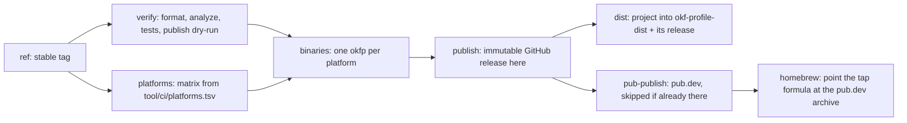

# Releasing okfp

How a tag of this repository turns into binaries, a pub.dev version, a public
distribution, and a Homebrew bump, and what has to move by hand afterwards.

## What a tag does

Pushing `vX.Y.Z` runs `.github/workflows/release.yml`:



- **publish** requires the repository's *immutable releases* setting to stay on.
  The job fails on purpose when a release lands mutable.
- **dist** rewrites [conceptadev/okf-profile-dist](https://github.com/conceptadev/okf-profile-dist)
  wholesale: `skills/`, `.claude-plugin/`, `tool/install.sh`, `tool/install.ps1`,
  `docs/install.md`, `LICENSE`, and a README rendered from `tool/dist/README.md`.
  Nothing in that repository is edited by hand. It then creates the same tag there
  with the `okfp` binaries attached, so the installer can download them without
  credentials.
- **homebrew** rewrites `url` and `sha256` in the tap's `Formula/okfp.rb` to the
  pub.dev archive of the released version. The formula builds from public source,
  so it never references this repository.

`dist` and `homebrew` authenticate as a GitHub App (below). The other jobs use the
workflow token.

## Bump sites

| Site | Moves when | Enforced by |
| --- | --- | --- |
| `packages/okf_profile/pubspec.yaml` `version`, `lib/src/cli.dart` `okfpPackageVersion`, `CHANGELOG.md` | every okfp release, before the tag | `verify-engine-version.sh` at build time |
| `OKFP_VERSION` in `tool/install.sh` and `$OkfpVersion` in `tool/install.ps1` | after the release is published, in a follow-up PR | `verify-installer-pins.sh` keeps the two files equal and reports drift from the package version |
| `okf:` in `packages/okf_profile/pubspec.yaml` and `OKF_VERSION` / `$OkfVersion` in both installers | when okfp moves to a new okf, in the same PR | `verify-installer-pins.sh` fails when the installer's okf differs from the okf that okfp embeds |
| `tool/ci/platforms.tsv` | when a platform is added; the same set must ship from conceptadev/okf | `sync-dist.sh` and `publish-release.sh` refuse a release missing an asset |
| Tap `Formula/okfp.rb` | automatic (`homebrew` job) | — |
| Tap `Formula/okf.rb` | conceptadev/okf's own release | — |

The installer pins point at a release that must already exist, which is why they
move *after* the tag rather than with the version bump: the `installer` CI job
runs `install.sh` for real and would go red in between.

## Release checklist

1. Bump the package version, `okfpPackageVersion`, and the changelog. If okf moved,
   bump `okf:` and both installers' `OKF_VERSION` in the same PR. Merge.
2. Push the tag. Watch `publish`, `dist`, `pub-publish`, and `homebrew` go green.
3. Open the follow-up PR that bumps `OKFP_VERSION` in both installers. Merge once
   the `installer` job is green.
4. Confirm `brew install conceptadev/tap/okfp` and the one-liner from
   `okf-profile-dist` both report the new version.

## The release app

`dist` and `homebrew` push to sibling repositories, so they need more than the
workflow token. They mint a short-lived installation token from a GitHub App:

- App: **okf-profile-release**, owned by the `conceptadev` organization.
- Repository permissions: **Contents: read and write**. Nothing else (Metadata is
  implied).
- Installed on: `okf-profile-dist`, `homebrew-tap`.
- This repository holds the app id as the Actions variable `RELEASE_APP_ID` and the
  private key as the secret `RELEASE_APP_PRIVATE_KEY`:

  ```sh
  gh variable set RELEASE_APP_ID --body '<app id>'
  gh secret set RELEASE_APP_PRIVATE_KEY < okf-profile-release.private-key.pem
  ```

## When this repository goes public

The distribution repository exists only because this one is private. Collapsing
back is three steps:

1. Delete the `dist` job, `tool/ci/sync-dist.sh`, and `tool/dist/`. Upload the
   binaries to this repository's release only (`publish` already does).
2. Change `OKFP_RELEASES` in both installers to `conceptadev/okf-profile`, and the
   marketplace command in `docs/install.md` and the README to
   `conceptadev/okf-profile`. Leave a last commit in `okf-profile-dist` whose
   `tool/install.sh` prints the new one-liner and exits, and whose README says
   "moved"; then archive it.
3. Tell teammates to run `/plugin marketplace add conceptadev/okf-profile` once.
   The marketplace name (`okf-profile`) and plugin name (`concepta-knowledge`) do
   not change, so every other command stays the same.
